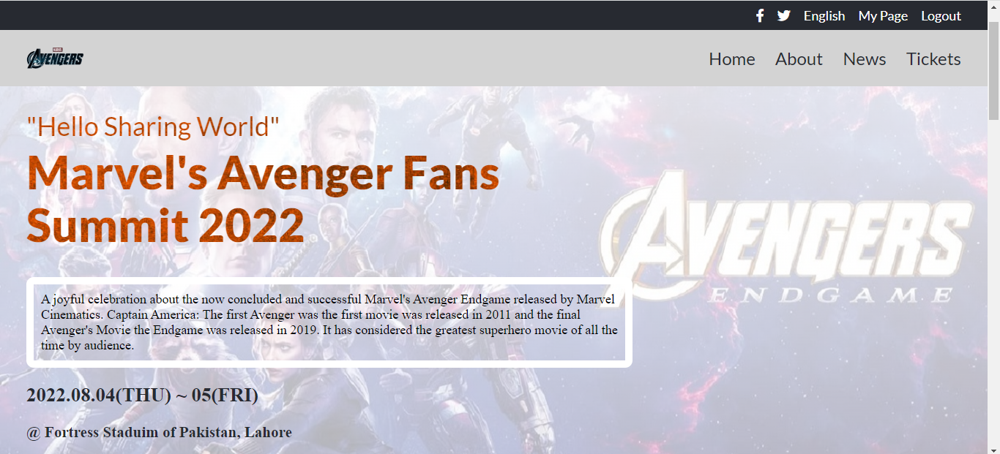

# Capstone-1
Marvel Avengers Fans Summit 2022 page event!

- Description the project.
**This Capstone show my experience as a software developer displaying an event page.**

> ## Objectives
- Use semantic HTML tags.
- Apply best practices in HTML code.
- Use CSS selectors correctly.
- Use CSS box model.
- Use Flexbox to place elements in the page.
- Demonstrate ability to create UIs adaptable to different screen sizes using media queries.
- Use GitHub Pages to deploy web pages.
- Apply JavaScript best practices and language style guides in code.
- Use JavaScript to manipulate DOM elements.
- Use JavaScript events.
- Use objects to store and access data.
- Communicate technical concepts to other technical people.
## Built With

- Major languages
    - HTML
    - CSS
    - Javascript
- Frameworks
    - HTML
    - CSS
    - Javascript
- Technologies used
    - VS Code Editor

### Prerequisites
Basic knowledge of
    - HTML
    - CSS
    - Javascript
### Setup
HTML & CSS

### Install
VS Code

### Deployment
Successful

## Live Demo Deployment
[Click here to see Live Demo](https://abrar052.github.io/capstone-1/)

## Preview
Following are the images of desktop version
-
-
-
-
-

Following are the images for the mobile version

-
-
-
-
-
-

## Video Demonstration
-

## Authors

👤 **Abrar Hussain**

- GitHub: [@githubhandle](https://github.com/Abrar052)
- Twitter: [@twitterhandle](https://twitter.com/bc160400820)
- LinkedIn: [LinkedIn](https://www.linkedin.com/in/abrar-hussain-225589238/)

## Acknowledgements

- All credits goes to this creative graphic desginer Guy  [Cindy Shin in Behance](https://www.behance.net/adagio07) the [ author of original design ](https://www.behance.net/gallery/29845175/CC-Global-Summit-2015).

## 🤝 Contributing

Contributions, issues, and feature requests are welcome!

Feel free to check the [issues page](../../issues/).

## Show your support

Give a ⭐️ if you like this project!

## 📝 License

This project is [MIT](./MIT.md) licensed.

### Original design idea by [Cindy Shin in Behance.](https://www.behance.net/adagio07)
